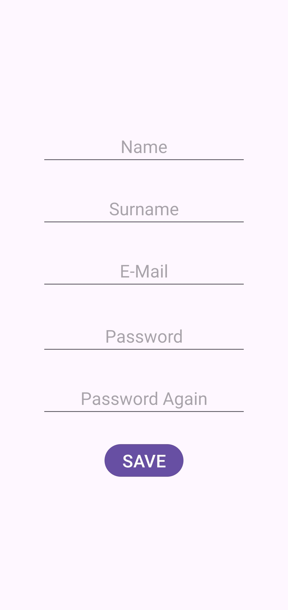
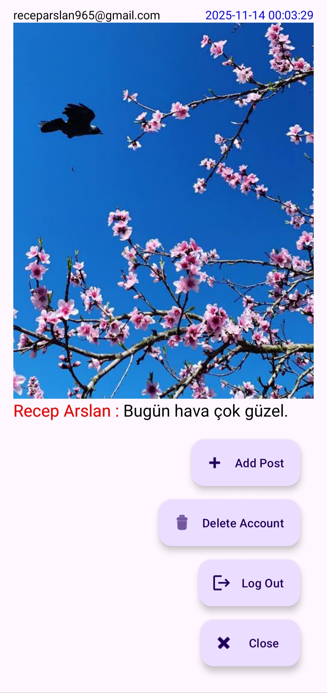
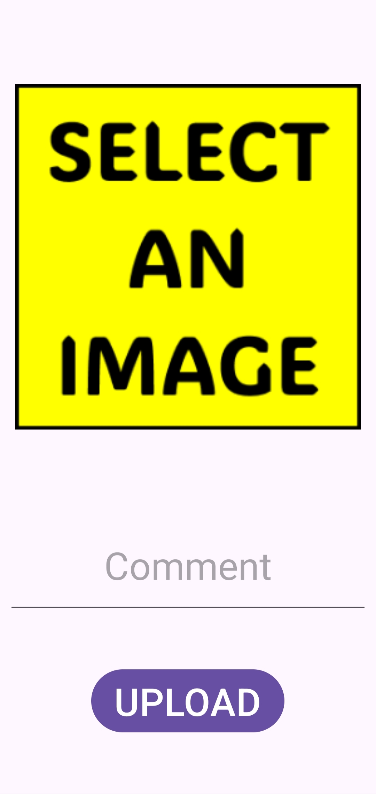

# Basic Social Media (Android • Java)

An educational Android application demonstrating a minimal social media experience built with Java, Firebase services, and modern Android libraries. Users can register, log in, create posts (optionally with images), and view a basic feed.

## Purpose
This project serves as a concise, didactic reference for core social media app concepts on Android using Java. It intentionally keeps architecture simple so learners can focus on:
- Authentication flow (login, registration, logout, re-auth + account deletion) via Firebase Auth.
- Structured data and real-time ordering of posts with Firestore (descending by timestamp).
- Media handling (image selection, upload to Firebase Storage, display with Picasso) and safe cleanup when deleting an account.
- Basic UI patterns: RecyclerView list rendering (`RecyclerAdapter`), model encapsulation (`Post`), FAB action grouping (extend/shrink pattern), and ViewBinding for type-safe view access.
- Connectivity/user experience considerations (periodic network checks + graceful alerts).

The code favors clarity over abstraction (direct SDK calls instead of repositories / ViewModels) to make it approachable for beginners or interview practice. It is a foundation you can evolve into MVVM + Clean Architecture, add caching/offline support, implement likes/comments, or apply Jetpack Compose. Security rules and error handling are minimal and should be hardened before any production use.

## Features
- User authentication (Firebase Auth: email/password)
- Create and display text/image posts (Firestore + Storage)
- Basic feed UI with image loading (Picasso)
- Analytics events (Firebase Analytics)
- Real-time / cloud data (Firestore / Realtime Database placeholder)
- ViewBinding for safer UI access

## Tech Stack
- Language: Java (source/target compatibility Java 9)
- Min SDK: 24 / Target SDK: 36
- Build system: Gradle (AGP 8.13.1)
- Firebase: Auth, Firestore, Storage, Realtime Database, Analytics (BOM 34.5.0)
- UI Libraries: AppCompat, Material Components, ConstraintLayout, GridLayout
- Image Loading: Picasso 2.71828
- Testing: JUnit 4, AndroidX Test (Ext JUnit, Espresso)

## Project Structure (High-Level)
```
app/
  src/
    main/ ... (activities, fragments, layouts)
  google-services.json (your Firebase config)
  build.gradle (module level)
build.gradle (project level)
settings.gradle
gradle/libs.versions.toml (centralized versions)
screenshots/ (static preview images)
```

## Screenshots
| Login                                                                    | Register                                                                       | Home Page                                                            | Create Post                                                            |
|--------------------------------------------------------------------------|--------------------------------------------------------------------------------|----------------------------------------------------------------------|------------------------------------------------------------------------|
|  |  |  |  |

## Getting Started
### 1. Prerequisites
- Android Studio (Hedgehog or newer recommended)
- JDK 17 installed (Android Studio bundles one; Java 9 source compatibility is set)
- A Firebase project (enable Authentication, Firestore, Storage, Analytics as needed)

### 2. Clone the Repository
```bash
git clone https://github.com/receparslan4247/Basic-Social-Media-Java.git
cd Basic-Social-Media-Java
```

### 3. Configure Firebase
1. Create a Firebase project in the Firebase Console.
2. Add an Android app with the package name: `com.receparslan.basicsocialmedia`.
3. Download the `google-services.json` provided by Firebase.
4. Place it inside `app/` (replacing the placeholder if present).
5. Ensure enabled products (Auth, Firestore, Storage, Analytics, Realtime Database if used).

### 4. Sync & Run
- Open the project in Android Studio.
- Let Gradle sync (will use `libs.versions.toml`).
- Run on an emulator or device (API Level 24+).

## Configuration Notes
- Versions are centralized in `gradle/libs.versions.toml`.
- Firebase BOM ensures aligned versions; individual Firebase modules do not specify versions directly.
- ViewBinding is enabled; find views through the generated binding classes.

## Testing
Run local unit tests:
```bash
./gradlew test
```
Run instrumentation tests (connected device/emulator required):
```bash
./gradlew connectedAndroidTest
```

## Architecture Overview
A simple MV-ish layer:
- UI Layer: Activities / Fragments using ViewBinding.
- Data Access: Direct Firebase SDK calls (Auth, Firestore, Storage).
- Image Loading: Picasso for remote Storage URLs.

This is intentionally minimal for educational purposes. You can evolve it toward a cleaner architecture (e.g., MVVM with ViewModel + LiveData/Flow + Repository abstraction).

## Roadmap Ideas
- Add pagination for feed
- Add likes/comments functionality
- Migrate to Jetpack Compose UI
- Add offline caching
- Replace direct Firebase calls with repository layer

## Contributing
1. Fork this repository
2. Create a feature branch (`git checkout -b feature/awesome-improvement`)
3. Commit changes (`git commit -m "Add awesome improvement"`)
4. Push branch (`git push origin feature/awesome-improvement`)
5. Open a Pull Request

Please keep changes focused and include screenshots for UI modifications.

## License
This project is licensed under the MIT License - see the `LICENSE` file for details.

## Disclaimer
This app is not production-ready. It is a learning scaffold. Review Firebase security rules and adjust before deploying publicly.

## Acknowledgements
- Firebase for backend services
- Square for Picasso
- AndroidX & Material Design Components

---
Feel free to open issues for bugs or feature suggestions.
